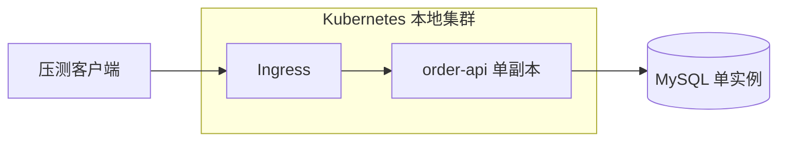
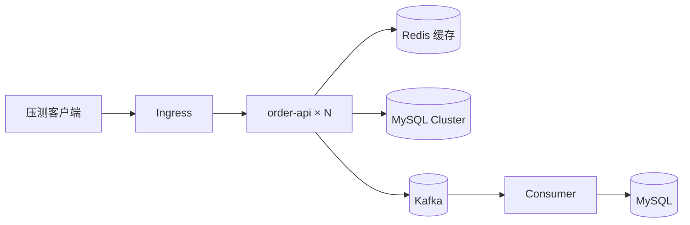

# 故障域与单点清单

## 1. v0 初始架构

- 初始仅单副本应用＋单实例 MySQL；Redis、Kafka 后续按实验引入。
- 目标：在明确单点的情况下做性能基线，不宣称任何高可用。

## 2. 故障域表

| 组件 | 当前副本 | 故障域 | 阶段宣称 |
|---|---|---|---|
| order-api | 2（HA 档；maxSurge 0/maxUnavailable 1，PDB minAvailable 1） | Pod | 单成员故障可用（EXP-14/15 验证） |
| MySQL | InnoDB Cluster ×3 + Router ×2（EXP-16） | 同宿主机（HA 模拟档） | 软件故障转移可用；宿主机级 HA 未验证 |
| Kafka | KRaft combined ×3（EXP-17，orders RF=3/min.isr=2） | 同宿主机（HA 模拟档） | 单/双 Broker 故障不丢事件；宿主机级未验证 |
| Redis | 1 | Pod | 可重建缓存，故障=降级回源（EXP-08 验证） |
| Router | 2 | 同宿主机 | 进程级冗余；qemu 镜像是性能单点（EXP-16 记录） |
| 压测机（k6-load） | 裸 Pod | 宿主机 | 无控制器，drain/到期即失（EXP-14 记录） |
| 监控栈 | 各 1 | 宿主机 | 观测目标，不承诺自身 HA |

## 3. 已明确的单点（SPOF）

- [x] ~~order-api 单副本~~（EXP-14 起多副本）
- [x] ~~MySQL 单实例~~（EXP-16 InnoDB Cluster）
- [x] ~~Kafka 单 Broker~~（EXP-17 KRaft ×3）
- [ ] 单宿主机（本地实验；EXP-14/16 明确标注模拟档）
- [ ] 本地磁盘 PVC（数据组件多副本仍在同一 local-path 故障域）
- [ ] mysql-router 无原生 arm64 镜像（qemu 模拟 = HA 档性能瓶颈，EXP-16 记录）
- [ ] 监控/Ingress 未做 HA（不在课程主线）

## 4. 故障域边界声明

- 本地单宿主机只用于功能/性能验证；**不宣称宿主机级 HA**。
- 节点/多副本故障实验需在 HA 模拟档（多逻辑 Node）或实证档（跨宿主）完成。
- 跨可用区/跨地域灾备不在本课程必做范围。

## 5. 演进后目标架构（参考）

- 该架构到 Phase 2 才逐步成形，每引入一个组件都必须有对应故障验证。
