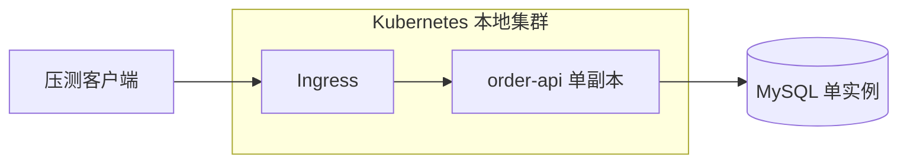
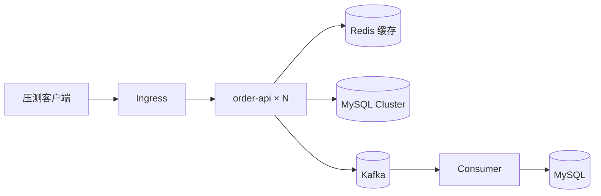

# 故障域与单点清单

## 1. v0 初始架构

- 初始仅单副本应用＋单实例 MySQL；Redis、Kafka 后续按实验引入。
- 目标：在明确单点的情况下做性能基线，不宣称任何高可用。

## 2. 故障域表

| 组件 | 当前副本 | 故障域 | 阶段宣称 |
|---|---|---|---|
| Ingress | 1 | 宿主机 | 仅单机可用 |
| order-api | 1 | Pod | 仅进程重启恢复 |
| MySQL | 1 | PVC 单副本 | 仅数据持久，无 failover |
| Redis | 未引入 | — | EXP-07 引入 |
| Kafka | 未引入 | — | EXP-09 引入 |
| 压测机 | 独立进程 | 宿主外 | 需监控自身不饱和 |
| 监控 | 未引入 | — | EXP-04 引入 |

## 3. 已明确的单点（SPOF）

- [ ] Ingress 单副本
- [ ] order-api 单副本
- [ ] MySQL 单实例
- [ ] 本地磁盘 PVC
- [ ] 单宿主机（本地实验）

## 4. 故障域边界声明

- 本地单宿主机只用于功能/性能验证；**不宣称宿主机级 HA**。
- 节点/多副本故障实验需在 HA 模拟档（多逻辑 Node）或实证档（跨宿主）完成。
- 跨可用区/跨地域灾备不在本课程必做范围。

## 5. 演进后目标架构（参考）

- 该架构到 Phase 2 才逐步成形，每引入一个组件都必须有对应故障验证。
