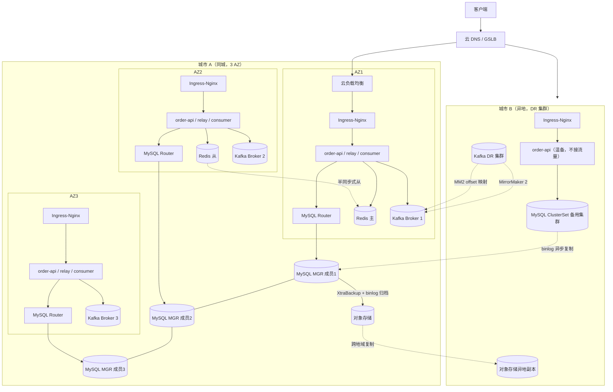

# 同城双活 + 异地灾备：选型与落地设计

> 状态：设计稿（选做扩展）。对应 roadmap 中 EXP-16/17（数据组件 HA）与 EXP-18（灾难恢复）的跨地域延伸。
> 本文是"选型结论 + 落地清单"，不是已完成的验收报告；每个阶段落地后仍需按实验规范提供故障时序、逐单对账与实测 RTO/RPO 证据。

## 1. 目标与范围

| 项目         | 定义                                                                                |
| ------------ | ----------------------------------------------------------------------------------- |
| 同城双活     | 同一城市多个可用区（AZ）同时承载业务流量，任一 AZ 故障后剩余 AZ 继续服务，RPO = 0   |
| 异地灾备     | 异地（另一城市）部署温备环境，城市级灾难时切换过去，接受分钟级 RPO                  |
| 目标 RTO/RPO | AZ 级故障 RTO ≤ 5 min / RPO = 0；城市级灾难 RTO ≤ 2 h（含决策时间）/ RPO ≤ 5 min |

**前提声明（不吹牛）**：

- "双活"指**应用与接入层双活**；MySQL 主线仍是**单主写**（InnoDB Cluster 单主模式），读流量可由本地 Router 分担到从节点。数据库双写双活需要冲突解决与单元化改造，不在本方案范围。
- 同城多活的质量取决于**故障域数量**：只有 2 个 AZ 时，任何多数派方案都无法做到"任一 AZ 全挂仍自动可用"。本方案同城默认按 **3 个 AZ** 设计；只有 2 个 AZ 的环境必须显式接受"单 AZ 全挂需人工决策"的限制（见 4.1）。
- Redis 在本课程只存**可重建查询缓存**，异地不复制 Redis，切换后冷启动重建，由 EXP-08 的有界回源保护 MySQL。

## 2. 选型结论：技术栈与软件清单

沿用课程主线技术栈，不引入第二套同类组件。**落地时锁定具体版本，不以 `latest` 复现。**

| 层次     | 软件                                | 版本基线（示例）                    | 同城角色                                  | 异地角色                                |
| -------- | ----------------------------------- | ----------------------------------- | ----------------------------------------- | --------------------------------------- |
| 流量接入 | 云 DNS / GSLB                       | —                                  | 按 AZ 权重分流 + 健康检查摘流             | 灾难切换入口                            |
| 入口     | Ingress-Nginx                       | 1.11.x                              | 每 AZ 一组，挂本 AZ 负载均衡              | DR 集群独立一组                         |
| 编排     | Kubernetes                          | 1.30.x                              | 单集群跨 3 AZ（node zone 标签）           | 独立 DR 集群（温备）                    |
| 数据库   | MySQL InnoDB Cluster + Router       | 8.0 LTS（Server/Shell/Router 同版） | MGR 单主 3 成员跨 3 AZ，每 AZ 一个 Router | ClusterSet 备用集群（异步复制）         |
| 缓存     | Redis + Sentinel                    | 7.x                                 | 1 主 1 从跨 AZ + 3 哨兵跨 3 AZ            | 不复制，切换后重建                      |
| 消息     | Kafka（KRaft）+ MirrorMaker 2       | 3.x                                 | 3 Broker/3 Controller 跨 3 AZ             | MM2 异步镜像 Topic + offset 映射        |
| 备份     | Percona XtraBackup + binlog 归档    | 8.x                                 | 每日全量 + binlog 持续归档                | 归档到异地对象存储                      |
| 对象存储 | 对象存储（S3/MinIO）                | —                                  | 备份与 Velero 落点                        | 跨地域复制                              |
| K8s 灾备 | Velero                              | 1.14.x                              | 资源 + PV 快照备份                        | DR 集群恢复                             |
| 可观测   | Prometheus + Grafana + Alertmanager | 2.x / 11.x                          | 每 AZ 抓取，Alertmanager 3 实例 HA        | 异地汇总（Thanos 或远程写），告警跨站点 |

**已明确排除**：Service Mesh、自研网关、KEDA、分库分表、跨地域多活（双写）、Redis 异地复制。这些是 roadmap 选做项，与同城双活灾备无关，不因"看起来完整"而引入。

## 3. 总体架构



要点：

- **应用层**：每 AZ 完整一组入口 + 应用副本（`topologySpreadConstraints` 保证按 zone 分散，实际副本数按容量预算）。
- **数据层**：MySQL MGR 3 成员跨 3 AZ（多数派在任意 2 个 AZ 即可选主）；Kafka 3 节点跨 3 AZ；Redis 主从跨 AZ + 哨兵 3 实例跨 3 AZ。
- **异地**：MySQL 异步复制（ClusterSet）、Kafka MM2 异步镜像、对象存储跨地域复制，三路异步同步共同决定 RPO。DR 集群应用**温备常驻**（部署但不接流量，降低 RTO）。
- **备份**：XtraBackup 全量 + binlog 归档与 Velero 备份均落在对象存储，靠对象存储跨地域复制保证"备份位于目标故障域之外"（EXP-18 前置条件）。

## 4. 核心设计决策

### 4.1 故障域与多数派：为什么是 3 个 AZ

- MySQL MGR / Kafka KRaft / Redis Sentinel 都依赖**多数派**。
- 2 个 AZ 任意分布（2+1、1+2、2+2）都无法让"任一 AZ 全挂"保留多数派。3 个 AZ 每域 1 成员时，丢 1 域剩 2/3，可自动恢复。
- 落地顺序：**先做同城 3 AZ**；若物理上只有 2 AZ，则数据组件按"主域 2 成员 + 备域 1 成员"部署，并书面接受：主域全挂 = 无多数派 = 停写，需人工将备域成员提升（RPO = 0 但 RTO 变长），该限制写入 runbook 与最终报告。

### 4.2 同城同步、异地异步

| 链路                     | 同步方式                                | RPO      | 说明                                   |
| ------------------------ | --------------------------------------- | -------- | -------------------------------------- |
| 同城 AZ 间（MySQL MGR）  | 同步（XCom 共识）                       | 0        | 事务需多数派确认；要求同城 RTT ≤ 2 ms |
| 同城 AZ 间（Kafka）      | 同步（`acks=all` + ISR）              | 0        | `min.insync.replicas=2`              |
| 同城 AZ 间（Redis）      | 半同步式（`min-replicas-to-write=1`） | ≈0      | 从落后超过阈值时主拒写                 |
| 异地 MySQL（ClusterSet） | 异步 binlog                             | ≤ 5 min | 网络中断后自动续传                     |
| 异地 Kafka（MM2）        | 异步镜像                                | ≤ 5 min | 含 offset 映射，切换可平移消费位点     |

**跨地域不做同步复制**：城市间 RTT 通常 > 10 ms，同步复制会把写入延迟直接变成跨城 RTT，且任一城故障即全停。异步 + 明确 RPO 才是灾备的正确形态。

### 4.3 Redis 不异地复制

课程约定 Redis 只存可重建缓存。异地切换后 Redis 空启动，回源 MySQL 由 EXP-08 的有界回源保护。省掉 Redis 异地复制（如 redis-shake / 双写）的运维成本与一致性问题。**如果未来缓存语义变为不可重建，本决策必须重开 ADR。**

### 4.4 Kafka 消费位点的异地平移

MM2 会把源集群 offset 映射到目标集群（`offset-syncs` 内部 Topic）。DR 切换后有两种取位方式：

1. **优先**：用 MM2 的 offset 映射平移消费组位点（`kafka-mirror-maker --offset.translate` 或消费 `offset-syncs` 逻辑）。
2. **兜底**：从 DR Topic 最新位点开始消费。课程有 Inbox 幂等去重与逐事件对账（EXP-09/18），重复/遗漏可检测、可解释；切换后必须执行一次 Outbox↔Kafka↔Inbox 对账，列出遗漏事件并单独补偿。

### 4.5 决策人（人肉 GSLB）

城市级灾难切换是**低频高危决策**，默认人工触发（避免误切）：告警 → 确认主城不可恢复 → 决策 → 执行 runbook。自动化只覆盖 AZ 级摘流（DNS 健康检查）与数据库内自动 failover。切换动作本身建议脚本化但不自动触发。

## 5. 各软件部署架构与配置

### 5.1 云 DNS / GSLB

- 架构：主城 3 个 AZ 入口地址加权轮询，权重按容量分配（如 1:1:1）；健康检查探测各 AZ 入口 `/healthz`，连续失败 N 次自动摘流；DR 入口权重 0 待命。
- 关键配置（以云 DNS 控制台语义描述，课程环境用等价脚本模拟）：

```text
record: order.example.com (A/AAAA)
  - az1-ingress-lb:  weight=1, health-check=HTTP /healthz, failover=false
  - az2-ingress-lb:  weight=1, health-check=HTTP /healthz
  - az3-ingress-lb:  weight=1, health-check=HTTP /healthz
  - dr-ingress-lb:   weight=0,  standby（城市级切换时启用）
  TTL ≤ 60s（切换时依赖 TTL 决定流量收敛速度，写入 RTO 预算）
```

- 自建限制：CoreDNS 无内建健康检查，自建 GSLB 需要额外组件；课程环境用"地址表 + 手工改权重 + k6 验证"模拟切换流程即可，不主张自研 GSLB。
- 注意：客户端若缓存长 TTL 或无视 TTL，DNS 摘流会失效；RTO 预算必须包含实测的流量收敛时间。

### 5.2 Kubernetes（同城主集群）

- 架构：单集群跨 3 AZ；控制面托管（云托管 K8s 自带多 AZ 控制面与 etcd）。自建控制面需 etcd 3 成员跨 3 AZ，属于 roadmap 选做，不在此展开。
- Node 打 zone 标签（云厂商通常自动注入）：

```yaml
# node 标签
topology.kubernetes.io/zone: az1   # az2 / az3
```

- 应用跨 AZ 分散（关键配置）：

```yaml
apiVersion: apps/v1
kind: Deployment
metadata:
  name: order-api
spec:
  replicas: 6
  template:
    spec:
      topologySpreadConstraints:
        - maxSkew: 1
          topologyKey: topology.kubernetes.io/zone
          whenUnsatisfiable: DoNotSchedule
          labelSelector:
            matchLabels: { app: order-api }
---
apiVersion: policy/v1
kind: PodDisruptionBudget
metadata:
  name: order-api-pdb
spec:
  minAvailable: 4
  selector:
    matchLabels: { app: order-api }
```

- 存储：PV 的 CSI 卷天然绑定单 AZ（课程 MySQL/Kafka 用 emptyDir/local-path 时无法跨 AZ 迁移，需记录在故障域清单）。云环境用云盘时，**每个数据组件成员使用本 AZ 云盘**，成员级冗余由 MGR/KRaft 提供，不依赖跨 AZ 卷。
- DR 集群：独立集群 + 同一份 Helm 模板（overlay 覆盖地址与副本数），由 GitOps/脚本保持配置一致；应用常驻温备。

### 5.3 Ingress-Nginx（每 AZ 一组）

- 部署：每 AZ 一个 Deployment（`nodeSelector: topology.kubernetes.io/zone=azX`），各自挂本 AZ 的 LoadBalancer 服务；副本数按 AZ 容量。
- 关键配置（Helm values 片段）：

```yaml
controller:
  replicaCount: 2
  nodeSelector: { "topology.kubernetes.io/zone": "az1" }   # 每 AZ 一份 overlay
  service:
    type: LoadBalancer
    annotations:
      service.beta.kubernetes.io/load-balancer-type: internal   # 本 AZ LB
  config:
    proxy-connect-timeout: "3"
    proxy-read-timeout: "10"
    proxy-send-timeout: "10"
    upstream-keepalive-connections: "100"
  metrics:
    enabled: true
    serviceMonitor:
      enabled: true
```

- 应用健康检查必须区分就绪与存活（EXP-02 约定）；Ingress 摘流依赖 readiness 探针。

### 5.4 MySQL：InnoDB Cluster 同城 3 AZ + ClusterSet 异地

- 架构：主集群 `flash-primary` 3 成员（每 AZ 一个，单主模式），每 AZ 部署一个 MySQL Router；异地备用集群 `flash-dr`（1~3 成员，异步复制）。客户端只连本 AZ Router，不直连成员。
- MGR 成员关键配置（my.cnf，三成员仅 `server_id` / `local_address` 不同）：

```ini
[mysqld]
server_id = 11                       # 12 / 13
gtid_mode = ON
enforce_gtid_consistency = ON
binlog_format = ROW
binlog_row_image = FULL
# MGR（跨 AZ：放宽驱逐阈值，避免链路抖动误判）
group_replication_group_name = "aaaaaaaa-bbbb-cccc-dddd-eeeeeeeeeeee"
group_replication_local_address = "mysql-az1:33061"
group_replication_group_seeds = "mysql-az1:33061,mysql-az2:33061,mysql-az3:33061"
group_replication_start_on_boot = OFF        # 由 mysqlsh / Operator 管理
group_replication_consistency = BEFORE_ON_PRIMARY_FAILOVER
group_replication_member_expel_timeout = 10  # 默认 5，跨 AZ 建议放宽
```

- 建集群与异地备用集群（mysqlsh 命令）：

```js
// 同城主集群
dba.createCluster('flash-primary', {memberWeight: 50})
cluster.addInstance('mysql-az2:3306')
cluster.addInstance('mysql-az3:3306')

// 异地备用集群（1 成员起步，异步复制通道受管）
dba.createCluster('flash-dr')
primary = dba.getCluster('flash-primary')
clusterset = primary.createClusterSet('flash-clusterset')
clusterset.createReplicaCluster('mysql-dr:3306', 'flash-dr', {recoveryProgress: 1})
```

- Router 关键配置（mysqlrouter.conf，每 AZ 一份）：

```ini
[routing:primary_rw]
bind_address = 0.0.0.0
bind_port    = 6446
destinations = metadata-cache://flash-clusterset/flash-primary?role=PRIMARY
routing_strategy = first-available

[routing:primary_ro]
bind_address = 0.0.0.0
bind_port    = 6447
destinations = metadata-cache://flash-clusterset/flash-primary?role=SECONDARY
routing_strategy = round-robin
```

- 应用连接串指向本 AZ Router（写 6446 / 读 6447）；读流量优先打本 AZ 从节点，降低跨 AZ 读延迟。可选（8.2+）开启 Router read-write splitting。
- 城市级切换（受控，人工执行）：

```js
clusterset.forcePrimaryCluster('flash-dr')   // 灾难切换；正常演练用 switchToCluster
```

- 注意：`forcePrimaryCluster` 后原主集群不再自动追平，恢复流程需重建或受控回切，runbook 必须写明（见 6.2）。

### 5.5 Redis：Sentinel 跨 AZ

- 架构：主实例 AZ1、从实例 AZ2，哨兵 3 实例跨 3 AZ（AZ3 仅哨兵）；客户端走 Sentinel 模式。
- 从实例（replica）关键配置：

```conf
replicaof redis-az1 6379
replica-read-only yes
repl-backlog-size 64mb
# 半同步式保障：主在从落后时拒写，RPO ≈ 0
min-replicas-to-write 1
min-replicas-max-lag 10
```

- 哨兵关键配置（sentinel.conf，3 实例仅地址不同）：

```conf
sentinel monitor flash-redis redis-az1 6379 2
sentinel down-after-milliseconds flash-redis 5000
sentinel failover-timeout flash-redis 30000
sentinel parallel-syncs flash-redis 1
```

- 客户端（Go）：使用 Sentinel 客户端（如 go-redis 的 `FailoverClient`），连接三个哨兵地址。
- 边界：Redis 故障只触发 EXP-08 的受控回源，不承诺 Redis 自身 RPO=0 之外的能力；异地不部署 Redis，切换后冷启动。

### 5.6 Kafka：KRaft 跨 3 AZ + MirrorMaker 2 异地镜像

- 架构：3 节点 `broker,controller` 合体部署，每 AZ 一个；DR 集群 1~3 节点；MM2 运行在主城或 DR 侧（推荐 DR 侧，主城灾难时不受影响）。
- Broker 关键配置（server.properties，节点间仅 `node.id` / `broker.rack` / 地址不同）：

```properties
process.roles = broker,controller
node.id = 1
controller.quorum.voters = 1@kafka-az1:9093,2@kafka-az2:9093,3@kafka-az3:9093
listeners = PLAINTEXT://:9092,CONTROLLER://:9093
controller.listener.names = CONTROLLER
broker.rack = az1                          # rack awareness：副本跨 AZ 分配
default.replication.factor = 3
min.insync.replicas = 2
unclean.leader.election.enable = false     # 宁停写不丢数据（EXP-17 约定）
offsets.topic.replication.factor = 3
transaction.state.log.replication.factor = 3
transaction.state.log.min.isr = 2
```

- 业务 Topic 与生产者（应用侧）：

```text
topic: flash-orders   replication-factor=3（副本按 rack 分布到 3 个 AZ）
producer: acks=all, retries 有限 + 退避（EXP-11 预算内）
consumer: 保序处理 + Inbox 去重（EXP-09 约定）
```

- MM2 关键配置（connect-mirror-maker.properties）：

```properties
clusters = primary, dr
primary.bootstrap.servers = kafka-az1:9092,kafka-az2:9092,kafka-az3:9092
dr.bootstrap.servers     = kafka-dr:9092

primary->dr.enabled = true
primary->dr.topics = flash-orders.*
replication.policy.class = org.apache.kafka.connect.mirror.IdentityReplicationPolicy
offset-syncs.topic.replication.factor = 3
# 消费组位点同步（用于切换时平移 offset）
primary->dr.groups = .*
primary->dr.emit.heartbeats.enabled = true
```

- 切换时位点处理：停 MM2 → 用 offset-syncs 映射平移 DR 消费组位点；无法平移时从最新位点消费，并执行 Outbox↔Kafka↔Inbox 对账兜底（4.4）。

### 5.7 备份：XtraBackup + binlog 归档 + Velero + 对象存储

- 架构：每日凌晨 XtraBackup 全量备份 → 对象存储；binlog 由归档脚本持续上传；对象存储开启跨地域复制（备份自动落到异地，满足 EXP-18"备份在故障域之外"）。
- 全量与 binlog（关键命令/配置）：

```bash
# 全量（在主城备份机或从节点上执行）
xtrabackup --backup --target-dir=/backup/full-$(date +%F) \
  --compress --stream=xbstream | aws s3 cp - s3://flash-backup/mysql/full-$(date +%F).xb

# binlog 持续归档（脚本轮询 + 上传，保留本地 24h）
mysqlbinlog --read-from-remote-server --raw --stop-never --host=mysql-az1 -u replica -p... &
aws s3 sync /backup/binlog s3://flash-backup/mysql/binlog/
```

- RPO 要求：binlog 归档频率 + 网络中断必须支撑"城市级灾难 RPO ≤ 5 min"；RPO 目标是 binlog 落点水位，实测数据损失窗口单独报告（EXP-18 口径）。
- Velero（K8s 资源 + PV 快照，落到同一对象存储）：

```bash
velero install \
  --provider aws \
  --plugins velero/velero-plugin-for-aws:v1.9.0 \
  --bucket flash-backup \
  --backup-location-config region=minio,s3ForcePathStyle=true,s3Url=http://minio:9000 \
  --secret-file ./credentials-velero

# 每日备份 + 每周保留
velero schedule create flash-daily --schedule "0 2 * * *" \
  --include-namespaces flash-order --ttl 720h0m0s

# DR 恢复
velero restore create --from-backup flash-daily-20260915 \
  --namespace-mappings flash-order:flash-order
```

### 5.8 可观测：Prometheus / Grafana / Alertmanager

- 架构：每 AZ 一个 Prometheus 抓本 AZ；Alertmanager 3 实例跨 3 AZ（gossip mesh，故障通知不随单 AZ 消失）；异地部署 Prometheus 接收远程写或 Thanos 查询层，保证主城灾难时监控仍可用。
- Alertmanager HA（关键参数）：

```text
--cluster.listen-address=0.0.0.0:9094
--cluster.peer=am-az1:9094 --cluster.peer=am-az2:9094
```

- 告警接收端（webhook/邮件）必须位于目标故障域之外；切换期间同时记录告警与业务对账（EXP-04 口径）。
- 异地汇总（二选一，按资源预算）：Thanos Receive（主城远程写 + 异地对象存储长期保存）或 VictoriaMetrics 远程写；课程最小实现可以是"DR 侧独立 Prometheus + 关键业务指标远程写"。

## 6. 故障场景与切换 Runbook

### 6.1 AZ 级故障（自动为主）

| 步骤 | 动作                                                          | 负责人 | 预期                               |
| ---- | ------------------------------------------------------------- | ------ | ---------------------------------- |
| 1    | DNS 健康检查自动摘除故障 AZ 入口                              | 自动   | 流量在 TTL 内收敛到剩余 AZ         |
| 2    | 确认 MGR/Kafka/哨兵多数派仍在（剩余 2 AZ）                    | 值班   | 数据库自动 failover（EXP-16 口径） |
| 3    | 观察剩余容量是否满足 SLO（EXP-19 剩余容量验证）               | 值班   | HPA/固定副本兜底                   |
| 4    | 故障 AZ 恢复后按受控顺序重新接入（先数据成员 rejoin，再入口） | 值班   | 无第二波故障                       |
| 5    | k6 冒烟 + 成功响应账本逐单核验                                | 值班   | 不变量成立                         |

停止条件：剩余 AZ 无法承载、监控失联、数据不变量破坏 → 转入城市级切换流程或按 3.3 安全边界止损。

### 6.2 城市级灾难（人工决策 + 脚本执行）

| 步骤 | 动作                                                               | 说明                                  |
| ---- | ------------------------------------------------------------------ | ------------------------------------- |
| 1    | 告警确认主城整体失联，评估不可恢复                                 | 决策人确认（避免误切）                |
| 2    | 冻结主城写入：摘 DNS 主城入口，隔离旧写入方                        | 防止切换后旧主复活造成双主            |
| 3    | MySQL：`clusterset.forcePrimaryCluster('flash-dr')`              | DR 集群成为新主；RPO = 复制积压水位   |
| 4    | Kafka：停 MM2，按 4.4 平移消费组位点                               | 无法平移则最新位点 + 对账兜底         |
| 5    | 启动 DR 集群应用（温备转活），Redis 冷启动                         | 受 EXP-08 有界回源保护                |
| 6    | DNS 切流到 DR 入口                                                 | 记录流量收敛时间（计入 RTO）          |
| 7    | 全量核验：订单/库存/幂等/Outbox/Inbox/后置副作用表                 | EXP-18 口径，列出损失订单与需补偿事件 |
| 8    | 主城恢复后：重建主城环境 → 反向追平数据 → 受控回切或保持 DR 为主 | 回切与初切同等演练                    |

**硬性要求**：切换脚本先在演练环境跑通；"隔离原环境 + 恢复到新环境"验证，不以销毁唯一副本为学习前提（3.3 安全边界）。每次演练记录实测 RTO、最后可恢复数据点与逐单损失。

## 7. RTO/RPO 预算表

| 场景                   | RPO 目标              | RTO 目标         | 依赖机制                                            |
| ---------------------- | --------------------- | ---------------- | --------------------------------------------------- |
| 单 AZ 故障             | 0                     | ≤ 5 min         | MGR/KRaft/哨兵多数派 + DNS 健康检查摘流             |
| 主城城市级灾难         | ≤ 5 min              | ≤ 2 h（含决策） | ClusterSet 异步复制 + MM2 + 备份异地副本 + 人工决策 |
| 数据损坏（非机房故障） | ≤ 24 h（上次备份点） | ≤ 4 h           | XtraBackup 全量 + binlog PITR                       |
| 逻辑错误（误删数据）   | 按备份点              | ≤ 4 h           | binlog 点位回放 / 备份恢复                          |

以上为设计目标；**落地后按 EXP-18 口径分别报告"目标 RPO / 实测数据损失窗口"、"目标 RTO / 实测恢复耗时"**。

## 8. 落地路线（分阶段，每阶段独立验收）

| 阶段             | 内容                                                                           | 对应实验    | 验收                                 |
| ---------------- | ------------------------------------------------------------------------------ | ----------- | ------------------------------------ |
| A 同城三 AZ 底座 | zone 标签、topologySpread、PDB、Ingress 每 AZ 一组、DNS 分流                   | EXP-13/14   | 单 AZ 摘流演练通过，流量收敛计时     |
| B 数据组件跨 AZ  | MGR 3 AZ + Router、Kafka 3 AZ KRaft、Redis 哨兵跨 AZ                           | EXP-16/17   | 单 AZ 数据组件故障演练通过，逐单核验 |
| C 异地备份与温备 | 对象存储异地复制、XtraBackup+binlog 归档、Velero、DR 集群温备、ClusterSet、MM2 | EXP-18 扩展 | 备份异地可恢复，DR 演练 RPO/RTO 达标 |
| D 灾难切换演练   | 城市级切换 runbook 脚本化，Game Day 实战                                       | EXP-19      | 实测 RTO/RPO、数据对账、复盘         |

每阶段冻结版本与配置快照；切换演练至少每季度一次。

## 9. 边界与不承诺

- 同城双活 ≠ 数据库双写双活；MySQL 主线为单主写，读本地化。
- 只有 2 个 AZ 的环境无法承诺"任一 AZ 全挂自动可用"，需书面接受限制（4.1）。
- 异地异步复制的 RPO 依赖网络与归档连续性，网络中断期间 RPO 会劣化，需有告警。
- 客户端长缓存 TTL、无视 TTL 的客户端会破坏 DNS 摘流效果；RTO 预算含实测收敛时间。
- 不承诺：跨地域双写多活、Redis 异地复制、真实支付/外部系统副作用的跨城一致性（外部副作用需另行对账，见 EXP-18 恢复边界）。
